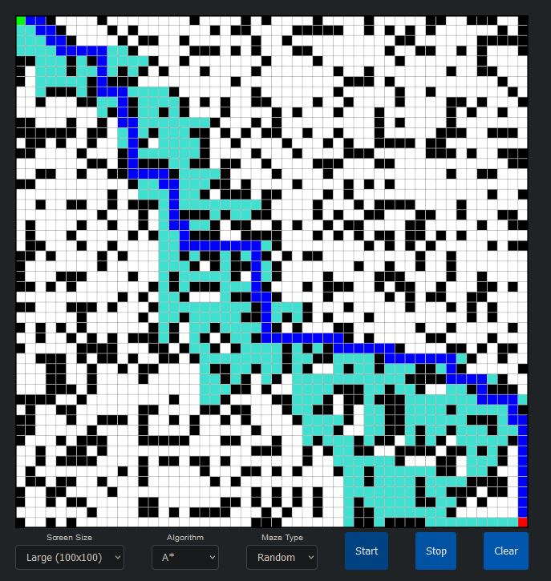

# 🎯 Pathfinding Visualizer Pro 🔍




## 🌟 Overview
An interactive pathfinding visualization tool built with Phaser.js that demonstrates various pathfinding algorithms in action. Watch in real-time as different algorithms find their way through mazes!

## ⚡ Features
- 🎮 Interactive grid system
- 🖱️ Draw walls with click & drag
- 🎨 Real-time visualization
- 🔄 Multiple grid sizes (25x25, 50x50, 100x100)
- 🧩 Preset maze patterns
- 🎲 Random maze generation

## 🔍 Algorithms Implemented
- A* (A-Star) Search Algorithm
- Dijkstra's Algorithm
- Breadth-First Search (BFS)
- Depth-First Search (DFS)

## 🛠️ Technologies
- Phaser.js 3.60.0
- HTML5 Canvas
- JavaScript ES6+

## 📥 Installation
1. Clone the repository:
```bash
git clone https://github.com/nyahav/PathFinderJS.git

browser
🎮 How to Use
Select grid size from dropdown
Choose an algorithm
Left click to:
Place start point (first click)
Place end point (second click)
Draw walls (subsequent clicks)
Click 'Start' to visualize the pathfinding
Use 'Clear' to reset the grid
Choose different maze patterns from the dropdown

🎨 Color Guide
🟢 Start Node (Green)
🔴 End Node (Red)
⚫ Walls (Black)
🔵 Found Path (Blue)
🌊 Visited Nodes (Turquoise)
🖼️ Screenshots


🔧 Contributing
Pull requests are welcome! For major changes, please open an issue first.

📜 License
MIT License - feel free to use this project for learning and development!

🙏 Acknowledgments
Phaser.js Team for the amazing game framework

